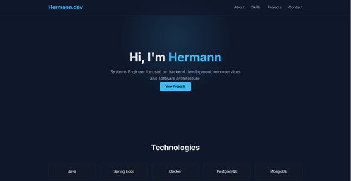

# Hermann Rodriguez T. Developer Portfolio

Modern dark-themed developer portfolio built with HTML, CSS and JavaScript.

## Live Demo

https://hermann72.github.io/modern-dev-portfolio/

## Preview

## About the Project

This project is my personal developer portfolio.
It showcases my skills, technologies I work with, and some of the projects I have built as a backend-focused engineer.

The goal of this project is to continuously improve it while learning modern frontend layout techniques and UI design.

## Features

- Modern dark UI
- Responsive layout
- Smooth scrolling navigation
- Scroll reveal animations
- Project showcase section
- Technologies section

## Technologies Used

- HTML5
- CSS3
- JavaScript
- Responsive Design

## Sections

The portfolio currently includes:

- Hero section
- About
- Technologies
- Projects
- Contact

## Future Improvements

Planned improvements for the project:

- Mobile navigation menu
- More project case studies
- Architecture experience section
- Performance optimizations
- UI/UX refinements

## Author

Hermann Rodríguez Triana
Systems Engineer & Backend Developer
